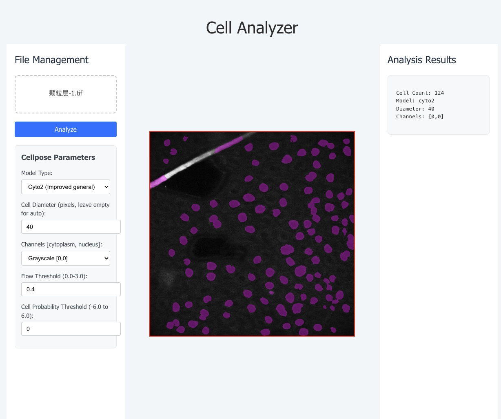

# Interactive Cell Image Analysis Platform

一个基于Web的细胞图像分割工具，专为细胞颗粒层图像分析而设计。该平台集成了先进的Cellpose深度学习模型，提供直观的用户界面和强大的分析功能。

## 🖼️ 界面预览



*应用主界面展示了文件上传、参数配置、图像显示和分析结果等核心功能*

## ✨ 主要功能

- **🔬 智能细胞识别**: 基于Cellpose深度学习模型的高精度细胞检测
- **⚙️ 参数可调**: 支持模型类型、细胞直径、通道配置等参数的实时调节
- **🚀 性能优化**: 模型缓存机制，避免重复下载，提升分析速度
- **📊 可视化结果**: 实时显示分析结果和检测到的细胞轮廓
- **💾 批量处理**: 支持TIFF格式图像的上传和分析

## 🛠️ 技术栈

### 后端
- **Python 3.8+**: 核心开发语言
- **Flask**: Web框架
- **Cellpose**: 细胞分割深度学习模型
- **OpenCV**: 图像处理
- **NumPy**: 数值计算

### 前端
- **React 18**: 用户界面框架
- **Vite**: 构建工具
- **CSS3**: 样式设计
- **Canvas API**: 图像显示和交互

## 📦 安装与运行

### 环境要求
- Python 3.8 或更高版本
- Node.js 16 或更高版本
- npm 或 yarn

### 后端设置

1. 克隆项目并进入后端目录：
   ```bash
   git clone <repository-url>
   cd cell_analyzer/backend
   ```

2. 创建并激活虚拟环境：
   ```bash
   python -m venv venv
   source venv/bin/activate  # macOS/Linux
   # 或 venv\Scripts\activate  # Windows
   ```

3. 安装依赖：
   ```bash
   pip install -r requirements.txt
   ```

4. 启动后端服务：
   ```bash
   python app.py
   ```
   后端服务将在 `http://localhost:5001` 运行

### 前端设置

1. 进入前端目录：
   ```bash
   cd ../frontend
   ```

2. 安装依赖：
   ```bash
   npm install
   ```

3. 启动开发服务器：
   ```bash
   npm run dev
   ```
   前端应用将在 `http://localhost:5173` 运行

## 🚀 使用指南

### 基本使用流程

1. **上传图像**: 点击"选择文件"按钮，上传TIFF格式的细胞图像
2. **参数配置**: 根据图像特点调整以下参数：
   - **模型类型**: 选择适合的Cellpose模型（cyto2、cyto、nuclei等）
   - **细胞直径**: 设置预期的细胞直径（像素）
   - **通道配置**: 设置细胞质和细胞核通道
   - **流阈值**: 调整细胞边界检测的敏感度
   - **细胞概率阈值**: 设置细胞识别的置信度阈值
3. **开始分析**: 点击"Analyze"按钮开始分析
4. **查看结果**: 分析完成后查看检测到的细胞数量和可视化结果

### 参数说明

| 参数 | 描述 | 推荐值 |
|------|------|--------|
| 模型类型 | Cellpose预训练模型 | cyto2（通用细胞）、nuclei（细胞核） |
| 细胞直径 | 预期细胞直径（像素） | 30-100（根据图像分辨率调整） |
| 细胞质通道 | 细胞质染色通道 | 0（灰度图像）或1-3（彩色图像） |
| 细胞核通道 | 细胞核染色通道 | 0（无核染色）或1-3 |
| 流阈值 | 边界检测敏感度 | 0.4-1.0 |
| 细胞概率阈值 | 细胞识别置信度 | 0.0-1.0 |

## 📁 项目结构

```
cell_analyzer/
├── backend/                 # 后端代码
│   ├── app.py              # Flask应用主文件
│   ├── requirements.txt    # Python依赖
│   ├── model_cache/        # 模型缓存目录
│   ├── uploads/            # 上传文件临时目录
│   └── venv/               # Python虚拟环境
├── frontend/               # 前端代码
│   ├── src/
│   │   ├── App.jsx         # 主应用组件
│   │   ├── App.css         # 样式文件
│   │   └── main.jsx        # 应用入口
│   ├── package.json        # Node.js依赖
│   └── vite.config.js      # Vite配置
├── docs/                   # 项目文档
├── test/                   # 测试文件
├── .gitignore             # Git忽略文件
├── LICENSE                # 开源许可证
└── README.md              # 项目说明
```

## 🔧 开发说明

### 核心特性

- **模型缓存**: 首次使用时自动下载并缓存Cellpose模型，后续使用无需重复下载
- **参数持久化**: 用户设置的参数会在分析结果中显示，便于重现实验
- **错误处理**: 完善的错误处理机制，提供友好的用户反馈
- **响应式设计**: 适配不同屏幕尺寸的设备

### API接口

#### POST /analyze
分析上传的细胞图像

**请求参数**:
- `file`: 图像文件（TIFF格式）
- `model_type`: 模型类型
- `diameter`: 细胞直径
- `channels`: 通道配置
- `flow_threshold`: 流阈值
- `cellprob_threshold`: 细胞概率阈值

**响应格式**:
```json
{
  "cell_count": 123,
  "analysis_time": 5.67,
  "parameters_used": {
    "model_type": "cyto2",
    "diameter": 50,
    "channels": [0, 0],
    "flow_threshold": 0.4,
    "cellprob_threshold": 0.0
  }
}
```

## 📄 许可证

本项目采用 MIT 许可证 - 查看 [LICENSE](LICENSE) 文件了解详情。

## 🤝 贡献

欢迎提交Issue和Pull Request来改进这个项目！

## 📞 支持

如果您在使用过程中遇到问题，请：
1. 查看本README文档
2. 检查终端输出的错误信息
3. 提交Issue描述问题详情

---

**注意**: 首次运行时，系统会自动下载Cellpose模型文件，这可能需要几分钟时间，请耐心等待。
